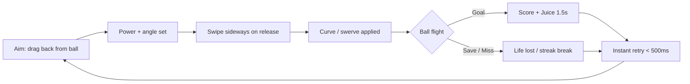

# ⚽ NEON STRIKE — WOW Plan

### HD HTML5 Mobile Hypercasual Soccer Kicks & Goals

> **Pitch:** Bend a swerving free-kick past a diving keeper into the top bins — one thumb, one breath, one more try.
>
> **Status:** Greenlight-ready design + executable build plan
> **Effort tier:** `xhigh` (autonomous, multi-phase, verified)
> **Target:** 60fps HD on mid-Android · 1-thumb portrait · installable PWA + Capacitor store wrap
> **Stack:** 100% free / OSS — no SaaS signup, no metering

---

## 0. The WOW (why this gets greenlit)

Every kick is a **4-second highlight reel**. Drag back to load power, swipe sideways to bend it, release to unleash a fire-trailed screamer that curves past a diving keeper and bursts the net in slow-motion confetti. Short enough to spam, deep enough to master, juicy enough to clip for TikTok.

The screenshot that stops the scroll: **a galaxy-textured ball arcing under a neon crossbar, net rippling green, "PERFECT +500" springing up.**

Three things make it WOW:

1. **Curve you can feel** — real Magnus swerve off a one-thumb flick; the ball visibly bends.
2. **The 1.5-second goal celebration** — hit-stop, slow-mo dolly through the net, confetti, crowd roar, haptic double-tap. Engineered frame-by-frame.
3. **Surreal skin moments** — fire ball on the moon, storm-weather crossbar ping, underwater slow-mo physics. Sharebait baked into the unlocks.

---

## 1. Vision & Elevator Pitch

*Neon Strike* is a one-thumb free-kick game for the TikTok era. You're a street-cage specialist bending impossible shots past keepers in neon stadiums, on the moon, underwater. Each attempt is 3–5 seconds; each goal is a cinematic. The meta-chase is distance, streak, and unlocking the galaxy ball that trails nebulae. It's *Tiny Striker*'s curl meets *Voodoo*'s one-tap simplicity meets *Rocket League Sideswipe* neon — built in Phaser 4, shipped as a PWA + native via Capacitor.

**Why it goes viral:** every goal produces a slo-mo clip worth sharing. The curve mechanic is a skill expression (you get better with practice), generating "no way that curved??" moments. The surreal stadiums (moon, underwater) are scroll-stoppers.

---

## 2. Core Game Loop

**Per-attempt time:** ~3–5s aim + 1.5s celebration + <500ms reset = **~5s loops**. Engineered for one-more-try addiction.

---

## 3. Primary Mechanic — Flick-Power × Swipe-Curve

**Hybrid flick + swipe-curve.** One thumb, one gesture.

| Input | Effect |
|---|---|
| Drag back from ball | Sets power (drag distance) + initial direction (drag angle) |
| Swipe sideways on release | Adds Magnus swerve (Δx of release swipe → curve magnitude) |
| Release | Launch ball: projectile motion + decaying curve |

**Custom lightweight physics model:**

$$\vec{v}_0 = k \cdot \vec{d}_{drag}$$

$$\vec{a}_{swerve}(t) = S \cdot \hat{\perp}(\vec{v}) \cdot e^{-t/\tau}$$

- $\vec{v}_0$ — initial velocity from drag vector, scaled by constant $k$
- $\vec{a}_{swerve}$ — perpendicular (sideways) acceleration that **decays exponentially** with time constant $\tau$, giving the intuitive "bend" feel
- Gravity $\vec{a}_g = (0, +g)$ constant
- Goalpost/net collision via Phaser Arcade Physics (AABB + circle)

**Why custom, not Matter.js:** full control of the arc + curve feel, smallest bundle, no cloth-sim overhead. Matter.js reserved only if we later want a true cloth net.

**Skill ceiling:** top-corner curve shots from 40m, low-power chips under the wall, backspin lobs, knucklers (no-spin wobble). Skill expression is the retention engine.

---

## 4. Difficulty Curve

| Level | Range | Obstacle | New Twist |
|---|---|---|---|
| 1 | 1–3 | Open goal | Teach flick |
| 2 | 4–6 | Static wall gap | Learn curve |
| 3 | 7–9 | Wall + idle keeper | Thread it |
| 4 | 10–12 | Side-shuffling keeper | Time the bend |
| 5 | 13–15 | + crosswind | Adjust arc |
| 6 | 16–18 | Leaping / diving keeper | Fake then curve |
| 7 | 19–21 | Moving target ring in goal | Precision |
| 8 | 22–24 | 2 keepers / split wall | Gap-read |
| 9 | 25–27 | Multi-ball (both must score) | Composure |
| 10 | 28+ | Storm + 2 keepers + timer | Buzzer-beater mastery |

**Lives:** 3 strikes. Miss = −1 life. **Perfect top-corner goal = +1 life** (rare, clutch). Run ends at 0 lives. Retry is a single tap on the respawn card — ball re-spawns, keeper resets, **<400ms** to next kick (pre-warmed scene, no loading).

---

## 5. Scoring & Combos

| Event | Points |
|---|---|
| Goal | +100 |
| Top-corner "perfect frame" | +150 bonus |
| Bank shot off post (in) | +250 bonus |
| Curved-shot style bonus | +30 |
| Distance bonus | +5/m beyond 20m |
| Streak multiplier | ×1.1 per consecutive goal (caps ×5) |

Miss = streak reset. Risk/reward: aim top bins (small target, big bonus) vs center (safe). **Perfect (top-corner + curve) regenerates a life.**

---

## 6. Five WOW Moments

1. **The 40m bender** — curving it around a diving keeper into the top bins from the halfway line.
2. **The knuckle** — no-spin shot wobbling past two keepers into the corner.
3. **Last-life clutch** — streak ×5, one life, perfect top-corner to revive.
4. **Bank-shot stunner** — off the far post, in, net ripples twice.
5. **Buzzer-beater dip** — storm, 2 keepers, ball dips under the bar at 0.3s.

---

## 7. Art Direction — "Neon Strike" Aesthetic

| Aspect | Spec |
|---|---|
| **Style** | Toon-shaded low-poly 3D baked to HD sprite-sheets, rim-lit with baked neon |
| **Palette** | Navy-black pitch `#0A0E1A`, magenta `#FF2D95`, cyan `#00E5FF`, sodium glow `#FFB347`, goal-spark green `#39FF14` |
| **Lighting** | Dusk/night stadium, neon rim-light, 2 god-ray planes, additive bloom on neons |
| **Camera** | 3rd-person low behind ball; 15° dutch-tilt lean into curve; slow-mo dolly through net on goal |
| **Ball** | 2-color swirled texture (8 frames), tapered ribbon trail tinted by skin |
| **HUD** | Top 25% only: score pill (top-center), streak flame ×N (top-right), 3 life dots (top-left), vertical distance meter (left edge). Bottom 75% clear for play. Combo bar glows when full. |

**References:** *Rocket League Sideswipe* (clean toon sheen), *Mario Strikers: Battle League* (aggressive neon hits), *Tron: Legacy* (rim-lit geometry in black).

### Goal Celebration — 1.5s WOW Beat (frame-by-frame)

| Time | Event |
|---|---|
| 0ms | Ball meets net → net bulges 1.5×, **hit-stop 60ms** |
| 80ms | Screen-shake amp 6 → 0 over 250ms (exp decay) |
| 120ms | Confetti + green sparks burst from impact; chromatic-aberration spike, fading by 600ms |
| 250ms | Slo-mo (0.35×), crowd roar swells, god-rays bloom on goal |
| 700ms | "GOAL +N" springs in (ease-out-back, overshoot 1.15); combo ticks up with a UI pluck per pip |
| 1100ms | Haptic double-tap via `navigator.vibrate([10,40,10])` |
| 1500ms | Snap back to kick cam, full speed |

### Juice FX Inventory

Confetti (200 cap), sparks (60), grass spray (30), net-ripple shader, exp-decay shake, 40–80ms hit-stop, chromatic aberration on goals/crossbar only, additive bloom on neons, 2 god-ray planes. Punch-zoom 1.03× on every kick contact.

---

## 8. Audio Identity

| Sound | Recipe |
|---|---|
| Kick thwack | Layered: sub thud + leather tick |
| Net swish | Filtered noise sweep |
| Post thud | Low sine pop |
| Crowd | 2-bar chant loop, sidechained, swells +1 semitone per goal |
| UI ticks | Short sine plucks |
| Adaptive music | Adds kick drum every 4th bar when streak ≥ 3 |

**iOS Safari unlock:** `AudioContext` starts suspended — `resume()` on first `pointerdown`/`touchstart`. No audio before a user gesture.

---

## 9. Meta-Progression & Unlocks

- **Balls:** fire (ember trail), ice (frost crackle), galaxy (nebula swirl), chrome (env reflection)
- **Trails:** rainbow, lightning, money
- **Kits:** 8 neon colorways
- **Stadiums:** street cage → neon arena → moon (low-grav floaty) → underwater (caustics + slow-mo physics)
- **Weather:** clear, rain, snow, storm
- **Daily Challenge:** fixed seed, global leaderboard
- **Achievements:** "100 swishes", "40m goal", "×5 streak"

---

## 10. Monetization (light-touch, no pay-to-win)

- **Rewarded video:** revive a run / double streak rewards — at the natural fail beat only
- **Cosmetic IAPs:** premium balls, kits, stadiums ($3–5)
- **Remove ads** ($4)
- **No pay-to-win** — cosmetics only; skill is the only advantage
- **AVOID:** interstitials mid-session, ads on every retry, energy gates, loot-box odds without disclosure

---

## 11. Controls & Accessibility

- Drag-from-ball flick; power = drag distance, **non-linear curve** (gentle early, steep past 60%)
- Horizontal release delta → curve magnitude
- **Aim assist toggle** (snaps to nearest gap, scales difficulty down)
- One-hand portrait, **colorblind-safe palette** (shape + color cues, green-on-navy contrast)
- Mute + haptic toggle, large touch zones (≥44px)

---

## 12. Market Research — Reference Games & Lessons

### Top reference games

| Game | Platform | The fun mechanic | Why players return |
|---|---|---|---|
| Flick Kick Football (PikPok) | Mobile | Flick-to-kick + arc | Tactile flick feel |
| Tiny Striker (Chillingo) | Mobile | Curl free-kick past wall + keeper | Skill mastery of curve |
| New Star Soccer | Mobile | Curl/swerve free-kick mini-game | Iconic bend mechanic |
| Soccer Stars (Miniclip) | Mobile | Billiards-style physics soccer | Strategy + physics |
| Football Strike (Miniclip) | Mobile | Shooting race, multiplayer | Head-to-head speed |
| Soccer Kick! (Voodoo) | Mobile | Tap-timing distance kick | Distance chasing, simple |
| Stickman Soccer | Mobile | Fast arcade matches | Pick-up-and-play |
| Retro Bowl | Mobile | Kicking component | Nostalgia + depth |
| Final Kick | Mobile | Swipe penalty shootout | Cinematic goals |
| Penalty Shooters (web) | Web | Timing-tap shootout | Browser-accessible |

### What makes hypercasual soccer addictive

- **Session:** 30–90s, instantly retryable
- **Dopamine moment:** ball hitting the net (visual + audio + haptic trifecta)
- **"One more try":** <500ms retry, no loading, stake escalation via streaks
- **Juice:** screen shake, particles, slow-mo on goal — the goal must *feel* like a goal

### Common mistakes that flop hypercasual soccer on mobile

1. Input lag / unresponsive touch → instant uninstall
2. No juice — flat visuals, no screen shake, weak audio
3. Loading between retries → kills the loop
4. Too hard too fast → frustration churn
5. Ads on every retry → rage-quit
6. Flat kicks with no curve/swerve → boring, no skill expression
7. Bad camera that hides the ball or goal
8. No clear "near-miss" feedback → feels unfair

### 3 viral WOW hooks for THIS game

1. **The curve rainbow goal** — galaxy ball arcing into the top corner, net bursting green sparks, slo-mo dolly. Pure "how did that curve??" sharebait.
2. **Fire ball + moon stadium** — low-grav lofted shot, ember trail over lunar surface, Earth in the skybox. Surreal scroll-stopper.
3. **Storm-weather crossbar ping** — lightning flash freeze-frames a chromatic-aberration ping off the bar, ball spinning into the net. Drama + glitch aesthetic.

---

## 13. Tech Stack (100% free / OSS, no SaaS dependency)

| Layer | Choice | Why |
|---|---|---|
| Engine | **Phaser 4.2.0 "Giedi"** (GA Jun 2026, WebGL2-native, SpriteGPULayer) | Best 2D WebGL, scene mgmt, input, audio, loader in one |
| Language | TypeScript 5 + Vite 6 | Fast HMR, type safety |
| Physics | Custom projectile + curve math | <50 lines, full control of feel |
| Audio | Phaser WebAudioSoundManager (+ Howler.js 2.2 fallback) | iOS-unlockable, cross-browser |
| Asset format | PNG/WebP sprite atlases (2048²), Spine 4.2 runtime | HD without huge downloads |
| Backend | PocketBase (single binary, MIT) | Collections = entities, API rules = RLS, built-in auth + file storage |
| Native wrap | Capacitor 8.4.1 | iOS App Store + Google Play from same web code |
| PWA / offline | Workbox 7 service worker | Installable, offline-capable |
| Analytics | PostHog (self-hostable) or GameAnalytics | Free tier, privacy-friendly |
| Build / verify | Vite + Vitest | Unit tests for physics |

> ⚠️ Verify all library APIs via Context7 (`resolve-library-id` → `get-library-docs`) before writing code. Never invent prop/method names.

### Performance budget

- **Bundle:** JS ≤500 KB gzipped (Phaser ~270 KB gz + app); first paint ≤3s on 4G
- **RAM:** peak ≤150 MB on mid-Android (Snapdragon 4-class)
- **Cold start:** interactive ≤4s
- **Frame rate:** locked 60fps; throttle to 30 before shedding effects
- **Particles:** ≤300 concurrent; pool + reuse
- **DPR:** cap at 2; sprite atlases ≤2048²
- **Asset total:** ≤8 MB for full game

### Mobile browser gotchas

- Avoid `100vh` (URL-bar jump); use `window.innerHeight` / `visualViewport`
- Safe-area insets: CSS `env(safe-area-inset-*)` + Capacitor `SystemBars`
- Lock scroll/zoom: `touch-action: none`, `overscroll-behavior: none`, viewport `user-scalable=no`
- PWA install via manifest + service worker; precache shell + first scene
- Capacitor 8.4.1 for store wrapping; native haptics/splash/status-bar plugins

---

## 14. Implementation Plan (checkpointed, risk-ordered)

### Global Constraints

- **Build:** `npm run dev` (Vite) · **Test:** `npx vitest` · **Lint:** `npx tsc --noEmit`
- Verify all library APIs via Context7 before use; never invent APIs
- One runnable check per non-trivial slice (Vitest asserts or Playwright vision)
- YAGNI, DRY; no speculative tasks; every task must be verifiable
- 60fps bar on mid-Android; design-QA gate (vision) before any UI task is "done"

---

### Phase 0 — Scaffold  `[independent]`
**Files:** `package.json`, `vite.config.ts`, `tsconfig.json`, `index.html`, `src/main.ts`, `src/scenes/Boot.ts`
**Change:** Vite + Phaser 4.2 + TS bootstrap; Boot scene loads → Main scene.
**Verify:** `npm run dev` → blank Phaser canvas at `localhost:5173`, no console errors.

---

### Phase 1 — Core Kick Mechanic  `[depends:0]`  ← riskiest, do first
**Files:** `src/scenes/Game.ts`, `src/physics/Ball.ts`, `src/physics/math.ts`, `tests/test_ball_physics.ts`
**Change:** Drag-from-ball input → release launches projectile with $v_0 = k \cdot d_{drag}$ + decaying swerve $a_{swerve}(t) = S \cdot \hat\perp(v) \cdot e^{-t/\tau}$ + gravity.
**Verify:** `npx vitest run tests/test_ball_physics.ts` — 3 asserts pass (straight, left curve, right curve); ball x at t=1s matches $v_{0_x}$ within 5%.

---

### Phase 2 — Goal, Net, Collision, Score  `[depends:1]`
**Files:** `src/scenes/Goal.ts`, `src/shaders/net-ripple.glsl`, `src/systems/ScoreSystem.ts`
**Change:** Goal-box AABB collision; net-ripple sine-displacement shader; score++, lives--, streak logic.
**Verify:** Vitest — ball in goal box → score+1, net shader fires; miss → lives-1.

---

### Phase 3 — Goal Celebration Sequence  `[depends:2]`
**Files:** `src/systems/Celebration.ts`, `src/effects/Confetti.ts`, `src/shaders/chromatic_aberration.glsl`
**Change:** 1.5s timeline: hit-stop → shake → confetti → slow-mo → score popup → haptic.
**Verify:** Playwright screenshot at 1440px; all 6 timeline events fire in order; `navigator.vibrate` mock asserts call pattern.

---

### Phase 4 — Audio System  `[depends:2]`  `[independent of 3]`
**Files:** `src/audio/AudioManager.ts`, `assets/sfx/*`
**Change:** Howler wrapper; kick/net/post foley; crowd chant loop; adaptive music; iOS `resume()` on first `pointerdown`.
**Verify:** Kick + goal trigger sound; assert `audioContext.state === 'running'` after first touch on Safari.

---

### Phase 5 — Goalkeeper, Wall, Difficulty Curve  `[depends:2]`
**Files:** `src/entities/Keeper.ts`, `src/entities/Wall.ts`, `src/systems/Difficulty.ts`, `src/systems/Wind.ts`
**Change:** Keeper AI (shuffle, dive, leap); wall positioning; 10-level difficulty table; crosswind force.
**Verify:** Vitest — levels 1→10 escalate obstacles per table; keeper blocks straight shots at level 4+.

---

### Phase 6 — Art & Skins Pass  `[depends:3,5]`  `[independent of 4]`
**Files:** `src/skins/SkinManager.ts`, `src/effects/Trail.ts`, `assets/skins/*.atlas`
**Change:** Neon toon sprites, 3 skins (default/galaxy/fire), ribbon trail, net-ripple + bloom shaders live.
**Verify:** **Design-QA gate** — Playwright screenshots at 1440px + 375px, light + dark; vision check against art-direction rubric; 60fps on mid-Android. Auto-fix until green.

---

### Phase 7 — Backend (PocketBase)  `[independent]`
**Files:** `pb/migrations/*`, `pb_hooks/*`, `src/api/client.ts`
**Change:** Collections (users, game_state, unlocks, skins, leaderboard); API rules `@request.auth.id = user_id`; weekly leaderboard reset cron.
**Verify:** Create user → submit score → query leaderboard; RLS test — user A cannot read user B's game_state (expect 403).

---

### Phase 8 — Meta Systems  `[depends:6,7]`
**Files:** `src/systems/UnlockSystem.ts`, `src/ui/Shop.ts`, `src/systems/DailyChallenge.ts`
**Change:** Skin unlocks at score thresholds; daily challenge fixed-seed; achievements; shop UI.
**Verify:** Vitest — score threshold → unlock fires; daily resets at midnight UTC.

---

### Phase 9 — Monetization  `[depends:8]`
**Files:** `src/ads/RewardedVideo.ts`, `src/iap/Store.ts`, `src/ui/GameOver.ts`
**Change:** Rewarded video on game-over (revive / double rewards); cosmetic IAPs; remove-ads toggle.
**Verify:** Mock ad SDK — rewarded video grants revive; IAP mock returns skin; no ads during gameplay.

---

### Phase 10 — PWA + Capacitor Wrap  `[depends:6]`
**Files:** `public/manifest.json`, `public/sw.js` (Workbox), `capacitor.config.ts`
**Change:** Installable PWA; precache shell + first scene; Capacitor Android/iOS config.
**Verify:** Lighthouse PWA audit ≥ 90; `npx cap add android && npx cap sync` succeeds; APK installs on emulator.

---

### Phase 11 — Design-QA Gate (non-negotiable)  `[depends:6,8,9]`
**Goal:** Every screen passes vision check at **desktop 1440px + mobile 375px, light + dark mode**.
**Rubric:** hierarchy, spacing, alignment, contrast, consistency (tokens/radius/shadows/icons), motion, loading/empty/error states, dark mode, accessibility, "would base44 ship this?".
**Verify:** Playwright screenshots → vision → all rubric items pass. Auto-fix + re-grade until green.

---

## 15. Success Criteria (Definition of Done)

- [ ] `npm run dev` launches game, no console errors
- [ ] Kick mechanic: drag → arc → curve works, physics asserts pass
- [ ] Goal detection + score + lives + streak work
- [ ] 1.5s celebration sequence fires all 6 events
- [ ] Audio plays on kick/goal, iOS unlocks on first touch
- [ ] 3 skins render, 60fps on mid-Android
- [ ] PocketBase: auth + RLS + leaderboard verified
- [ ] Monetization: rewarded video + IAP mock work, no ads in gameplay
- [ ] PWA Lighthouse ≥ 90, Android APK builds
- [ ] **Design-QA gate passed (vision-checked at 1440px + 375px, light + dark)**

---

## 16. Risks & Mitigations

| Risk | Impact | Mitigation |
|---|---|---|
| Phaser 4.2 is new (Jun 2026) — docs/API gaps | Medium | Pin version; verify via Context7; keep v3.90 fallback |
| iOS audio unlock fragility | High | Test on real Safari early (Phase 4); Howler handles most cases |
| WebGL2 on old devices | Low | Canvas2D fallback renderer; detect via `WebGLRenderingContext` |
| PocketBase RLS misconfiguration = data leak | High | Dedicated RLS test in Phase 7; Security Auditor review |
| Scope creep on skins/shop | Medium | Ship Phase 6 with 3 skins only; rest post-launch |
| Vision-QA gate time cost | Medium | Run per-phase, not just at end |
| Curve feel "wrong" | High | Phase 1 first; tune $\tau$ and $S$ via playtest before building on top |

---

*Plan version: 1.0 — 2026-07-04*
*Built with: brainstorming → writing-plans skills · parallel Ruflo research agents (Intelligence Specialist ×2, Architect ×2)*
